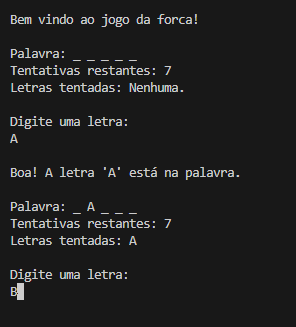

# 🎯 Jogo da Forca (Hangman)


Um jogo da forca (Hangman) desenvolvido em Python para execução no terminal. 
O jogador deve adivinhar a palavra secreta letra por letra antes de esgotar o número máximo de tentativas.

---
## 📌 Funcionalidades
- 🎮 Jogo interativo no terminal
- 🔤 Entrada de letras pelo usuário
- ❤️ Sistema de vidas
- ❌ Validação de entradas
- 🔁 Detecção de letras repetidas
- 🏆 Condição de vitória e derrota
---

## 🎥 Demonstração



Ou veja a versão em terminal:
https://asciinema.org/

```bash
===== JOGO DA FORCA =====

Palavra: _ _ _ _ _
Tentativas restantes: 6

Digite uma letra: a

Palavra: _ a _ _ a
Tentativas restantes: 6

Digite uma letra: z

Letra incorreta!
Tentativas restantes: 5
```
